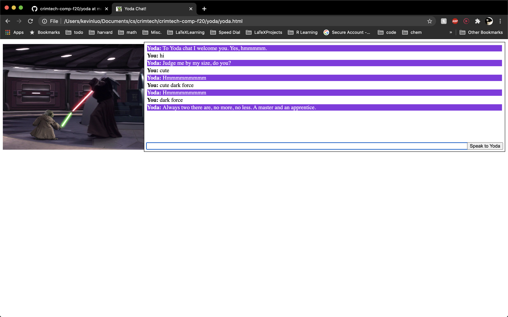
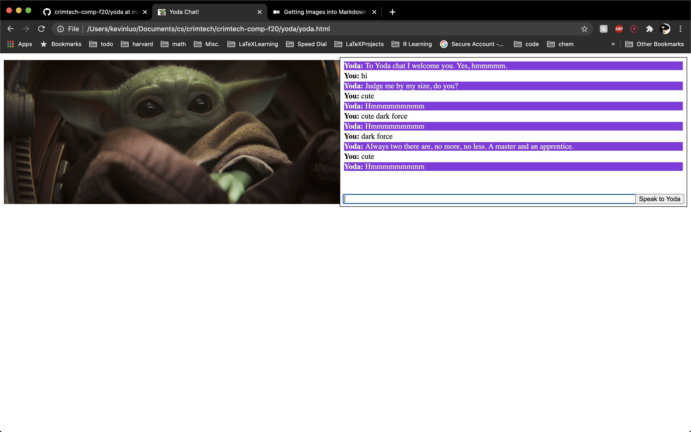
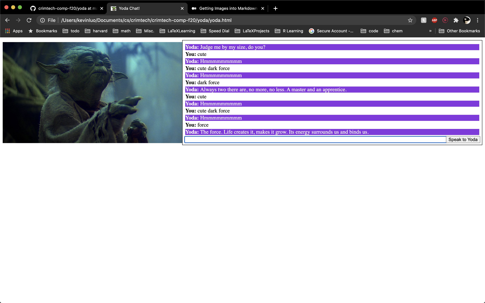

# Yoda Chat: Responses

## B. Inspect Mode

1. easter egg: chocolate
2. next_week = "Guest talk?"
3. s7.addthis.com

## C. Welcome to Programming in Javascript

3.

```js
var y = "Hello World";
y.includes("hello"); // true
y.repeat(10); // "hello world!hello world!hello world!hello world!hello world!hello world!hello world!hello world!hello world!hello world!"
```

4.

```js
function square(i) = {
    return i * i;
}

square(2.5); //6.25
square("hello") //NaN
```

5.

```js
function square1(i) = {
    if(typeof i !== "number") return -1;
    return i * i;
}
```

6.

```js
function numberString(i) {
  if (i <= 0 || typeof i !== "number") return;
  let s = "";
  for (let j = 1; j <= i; j++) {
    s += j;
  }
  return s;
}
```

## G. Optional Projects

Not my proudest work, but it works. The images are different widths so the chat box moves though.

Some photos:



